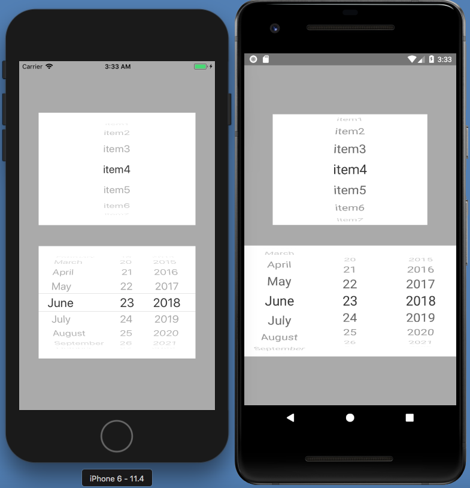

# react-native-wheel-pick

React native wheel picker for both iOS and android. (Support DatePicker)



This is not original but inspire by  [react-native-wheel-datepicker](https://github.com/pinguinjkeke/react-native-wheel-datepicker)

## How to use

```
npm i react-native-wheel-pick --save
react-native link react-native-wheel-pick
```
## Example code

```jsx
import { Picker, DatePicker } from 'react-native-wheel-pick';

// use Picker
<Picker
  style={{ width: 321, height: 215 }}
  selectedValue='12:15'
  pickerData={['11:30', '11:45', '12:00', '12:15', '12:30', '12:45', '13:00']}
  onValueChange={value => {}}
/>

// use DatePicker
<DatePicker
  style={{ width: 321, height: 215 }}
  mode='date'
  onValueChange={val => {}}
/>

```
